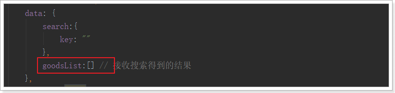
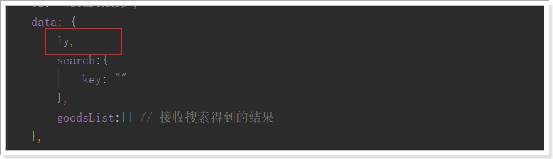

# 1.搭建前台系统

后台系统的内容暂时告一段落，有了商品，接下来我们就要在页面展示商品，给用户提供浏览和购买的入口，那就是我们的门户系统。

门户系统面向的是用户，安全性很重要，而且搜索引擎对于单页应用并不友好。因此我们的门户系统不再采用与后台系统类似的SPA（单页应用）。

依然是前后端分离，不过前端的页面会使用独立的html，在每个页面中使用vue来做页面渲染。

## 1.1.静态资源

webpack打包多页应用配置比较繁琐，项目结构也相对复杂。这里为了简化开发（毕竟我们不是专业的前端人员），我们不再使用webpack，而是直接编写原生的静态HTML。


### 1.1.1.创建工程

创建一个新的工程：


### 1.1.2.导入静态资源

将课前资料中的hz-portal解压，并复制到这个项目下


解压缩：


项目结构：


## 1.2.live-server

没有webpack，我们就无法使用webpack-dev-server运行这个项目，实现热部署。

所以，这里我们使用另外一种热部署方式：live-server，

### 1.2.1.简介

地址；https://www.npmjs.com/package/live-server

 

这是一款带有热加载功能的小型开发服务器。用它来展示你的HTML / JavaScript / CSS，但不能用于部署最终的网站。 


### 1.2.2.安装和运行参数

安装，使用npm命令即可，这里建议全局安装，以后任意位置可用

```
npm install -g live-server
```


运行时，直接输入命令：

```
live-server
```

另外，你可以在运行命令后，跟上一些参数以配置：

- `--port=NUMBER` - 选择要使用的端口，默认值：PORT env var或8080
- `--host=ADDRESS` - 选择要绑定的主机地址，默认值：IP env var或0.0.0.0（“任意地址”）
- `--no-browser` - 禁止自动Web浏览器启动
- `--browser=BROWSER` - 指定使用浏览器而不是系统默认值
- `--quiet | -q` - 禁止记录
- `--verbose | -V` - 更多日志记录（记录所有请求，显示所有侦听的IPv4接口等）
- `--open=PATH` - 启动浏览器到PATH而不是服务器root
- `--watch=PATH` - 用逗号分隔的路径来专门监视变化（默认值：观看所有内容）
- `--ignore=PATH`- 要忽略的逗号分隔的路径字符串（[anymatch](https://github.com/es128/anymatch) -compatible definition）
- `--ignorePattern=RGXP`-文件的正则表达式忽略（即`.*\.jade`）（**不推荐使用**赞成`--ignore`）
- `--middleware=PATH` - 导出要添加的中间件功能的.js文件的路径; 可以是没有路径的名称，也可以是引用`middleware`文件夹中捆绑的中间件的扩展名
- `--entry-file=PATH` - 提供此文件（服务器根目录）代替丢失的文件（对单页应用程序有用）
- `--mount=ROUTE:PATH` - 在定义的路线下提供路径内容（可能有多个定义）
- `--spa` - 将请求从/ abc转换为/＃/ abc（方便单页应用）
- `--wait=MILLISECONDS` - （默认100ms）等待所有更改，然后重新加载
- `--htpasswd=PATH` - 启用期待位于PATH的htpasswd文件的http-auth
- `--cors` - 为任何来源启用CORS（反映请求源，支持凭证的请求）
- `--https=PATH` - 到HTTPS配置模块的路径
- `--proxy=ROUTE:URL` - 代理ROUTE到URL的所有请求
- `--help | -h` - 显示简洁的使用提示并退出
- `--version | -v` - 显示版本并退出


### 1.2.1.测试

我们进入hz-portal目录，输入命令：

```
live-server --port=9002
```


## 1.3.域名访问

现在我们访问只能通过：http://127.0.0.1:9002

我们希望用域名访问：http://www.hz.com

第一步，修改hosts文件，添加一行配置：

```
192.168.1.109 www.hz.com
```

第二步，修改nginx配置，将www.hz.com反向代理到127.0.0.1:9002

```nginx
server {
    listen       80;
    server_name  www.hz.com;

    proxy_set_header X-Forwarded-Host $host;
    proxy_set_header X-Forwarded-Server $host;
    proxy_set_header X-Forwarded-For $proxy_add_x_forwarded_for;

    location / {
        proxy_pass http://192.168.1.114:9002;
        proxy_connect_timeout 600;
        proxy_read_timeout 600;
    }
}
```

重新加载nginx配置：`nginx.exe -s reload`


## 1.4.common.js

为了方便后续的开发，我们在前台系统中定义了一些工具，放在了common.js中：


部分代码截图：


首先对axios进行了一些全局配置，请求超时时间，请求的基础路径，是否允许跨域操作cookie等

定义了对象 ly ，也叫hz，包含了下面的属性：

- getUrlParam(key)：获取url路径中的参数
- http：axios对象的别名。以后发起ajax请求，可以用ly.http.get()
- store：localstorage便捷操作，后面用到再详细说明
- formatPrice：格式化价格，如果传入的是字符串，则扩大100被并转为数字，如果传入是数字，则缩小100倍并转为字符串
- formatDate(val, pattern)：对日期对象val按照指定的pattern模板进行格式化
- stringify：将对象转为参数字符串
- parse：将参数字符串变为js对象


# 1.索引库数据导入

昨天我们学习了Elasticsearch的基本应用。今天就学以致用，搭建搜索微服务，实现搜索功能。

## 1.1.创建搜索服务

创建module：


Pom文件：

```xml
<?xml version="1.0" encoding="UTF-8"?>
<project xmlns="http://maven.apache.org/POM/4.0.0"
         xmlns:xsi="http://www.w3.org/2001/XMLSchema-instance"
         xsi:schemaLocation="http://maven.apache.org/POM/4.0.0 http://maven.apache.org/xsd/maven-4.0.0.xsd">
    <parent>
        <artifactId>hz</artifactId>
        <groupId>com.hz.parent</groupId>
        <version>0.0.1-SNAPSHOT</version>
    </parent>
    <modelVersion>4.0.0</modelVersion>

    <groupId>com.hz.service</groupId>
    <artifactId>hz-search</artifactId>
    <version>0.0.1-SNAPSHOT</version>

    <dependencies>
        <!-- web -->
        <dependency>
            <groupId>org.springframework.boot</groupId>
            <artifactId>spring-boot-starter-web</artifactId>
        </dependency>

        <!-- eureka -->
        <dependency>
            <groupId>org.springframework.cloud</groupId>
            <artifactId>spring-cloud-starter-netflix-eureka-client</artifactId>
        </dependency>
        <!-- feign -->
        <dependency>
            <groupId>org.springframework.cloud</groupId>
            <artifactId>spring-cloud-starter-openfeign</artifactId>
        </dependency>
    </dependencies>


</project>
```

application.yml：

```yaml
server:
  port: 8083
spring:
  application:
    name: search-service

eureka:
  client:
    service-url:
      defaultZone: http://127.0.0.1:10086/eureka
  instance:
    lease-renewal-interval-in-seconds: 5 # 每隔5秒发送一次心跳
    lease-expiration-duration-in-seconds: 10 # 10秒不发送就过期
    prefer-ip-address: true
    ip-address: 127.0.0.1
    instance-id: ${spring.application.name}:${server.port}
```

启动类：

```java
@SpringBootApplication
@EnableDiscoveryClient
@EnableFeignClients
public class HzSearchService {

    public static void main(String[] args) {
        SpringApplication.run(HzSearchService.class, args);
    }
}
```


## 1.2.数据格式分析

接下来，我们需要商品数据，便于用户搜索。

那么问题来了，我们有SPU和SKU，到底如何保存？

### 1.2.1.以结果为导向

大家来看下搜索结果页：


可以看到，每一个搜索结果都有至少1个商品，当我们选择大图下方的小图，商品会跟着变化。

因此，**搜索的结果是SPU，即多个SKU的集合**。

既然搜索的结果是SPU，那么我们索引库中存储的应该也是SPU，但是却需要包含SKU的信息。


### 1.2.2.需要什么数据

再来看看页面中有什么数据：

 

直观能看到的：图片、价格、标题、副标题

暗藏的数据：spu的id，sku的id


另外，页面还有过滤条件：


这些过滤条件也都需要存储到索引库中，包括：

商品分类、品牌、可用来搜索的规格参数等

综上所述，我们需要的数据格式有：

spuId、SkuId、商品分类id、品牌id、图片、价格、商品的创建时间、sku信息集、可搜索的规格参数


### 1.2.3.最终的数据结构

我们创建一个类，封装要保存到索引库的数据，并设置映射属性：

```java

public class Goods {
    private Long id; // spuId
    private String subTitle;// 卖点
    private Long brandId;// 品牌id
    private Long cid1;// 1级分类id
    private Long cid2;// 2级分类id
    private Long cid3;// 3级分类id
    private Date createTime;// 创建时间
    private List<Long> price;// 价格
    private String skus;// sku信息的json结构
    private Map<String, Object> specs;// 可搜索的规格参数，key是参数名，值是参数值
}
```

一些特殊字段解释：

- price：价格数组，是所有sku的价格集合。方便根据价格进行筛选过滤

- skus：用于页面展示的sku信息，不索引，不搜索。包含skuId、image、price、title字段

- specs：所有规格参数的集合。key是参数名，值是参数值。

  例如：我们在specs中存储 内存：4G,6G，颜色为红色，转为json就是：

  ```json
  {
      "specs":{
          "内存":[4G,6G],
          "颜色":"红色"
      }
  }
  ```

  当存储到索引库时，elasticsearch会处理为两个字段：

  - specs.内存：[4G,6G]
  - specs.颜色：红色

  另外， 对于字符串类型，还会额外存储一个字段，这个字段不会分词，用作聚合。

  - specs.颜色.keyword：红色


## 1.3.商品微服务提供接口

索引库中的数据来自于数据库，我们不能直接去查询商品的数据库，因为真实开发中，每个微服务都是相互独立的，包括数据库也是一样。所以我们只能调用商品微服务提供的接口服务。

先思考我们需要的数据：

- SPU信息
- SKU信息
- SPU的详情
- 商品分类名称（拼接all字段）

再思考我们需要哪些服务：

- 第一：分批查询spu的服务，已经写过。
- 第二：根据spuId查询sku的服务，已经写过
- 第三：根据spuId查询SpuDetail的服务，已经写过
- 第四：根据商品分类id，查询商品分类名称，没写过
- 第五：根据商品品牌id，查询商品的品牌，没写过

因此我们需要额外提供一个查询商品分类名称的接口。


### 1.3.1.商品分类名称查询

controller：

```java
/**
     * 根据商品分类id查询名称
     * @param ids 要查询的分类id集合
     * @return 多个名称的集合
     */
    @GetMapping("/names")
    public ResponseEntity<List<String>> queryNameByIds(@RequestParam("ids") List<Long> ids){
        List<String > list = this.categoryService.queryNameByIds(ids);
        if (list == null || list.size() < 1) {
            return new ResponseEntity<>(HttpStatus.NOT_FOUND);
        }
        return ResponseEntity.ok(list);
    }
```

测试：


### 1.3.2.编写FeignClient

#### 1.3.2.1.问题展现

操作hz-search工程

现在，我们要在搜索微服务调用商品微服务的接口。

第一步要引入商品微服务依赖：`hz-item-interface`。

```xml
<!--商品微服务-->
<dependency>
   <groupId>com.hz.service</groupId>
   <artifactId>hz-item-interface</artifactId>
   <version>0.0.1-SNAPSHOT</version>
   <exclusions>
       <!--只需要接口和实体类，不需要mybatis包-->
       <exclusion>
           <groupId>com.baomidou</groupId>
           <artifactId>mybatis-plus-boot-starter</artifactId>
       </exclusion>
   </exclusions>
</dependency>
```

第二步，编写FeignClient

```java
@FeignClient(value = "item-service")
@RequestMapping("/goods")
public interface GoodsClient {

    /**
     * 分页查询商品
     * @param page
     * @param rows
     * @param saleable
     * @param key
     * @return
     */
    @GetMapping("/spu/page")
    ResponseEntity<PageResult<SpuBo>> querySpuByPage(
            @RequestParam(value = "page", defaultValue = "1") Integer page,
            @RequestParam(value = "rows", defaultValue = "5") Integer rows,
            @RequestParam(value = "saleable", defaultValue = "true") Boolean saleable,
            @RequestParam(value = "key", required = false) String key);

    /**
     * 根据spu商品id查询详情
     * @param id
     * @return
     */
    @GetMapping("/spu/detail/{id}")
    ResponseEntity<SpuDetail> querySpuDetailById(@PathVariable("id") Long id);

    /**
     * 根据spu的id查询sku
     * @param id
     * @return
     */
    @GetMapping("sku/list")
    ResponseEntity<List<Sku>> querySkuBySpuId(@RequestParam("id") Long id);
}
```

以上的这些代码直接从商品微服务中拷贝而来，完全一致。差别就是没有方法的具体实现。大家觉得这样有没有问题？


而FeignClient代码遵循SpringMVC的风格，因此与商品微服务的Controller完全一致。这样就存在一定的问题：

- 代码冗余。尽管不用写实现，只是写接口，但服务调用方要写与服务controller一致的代码，有几个消费者就要写几次。
- 增加开发成本。调用方还得清楚知道接口的路径，才能编写正确的FeignClient。


#### 1.3.2.2.解决方案

因此，一种比较友好的实践是这样的：

- 我们的服务提供方不仅提供实体类，还要提供api接口声明
- 调用方不用字自己编写接口方法声明，直接继承提供方给的Api接口即可，


第一步：服务的提供方在`hz-item-interface`中提供API接口，并编写接口声明：


商品分类服务接口：

```java
@RequestMapping("/category")
public interface CategoryApi {
    
 @GetMapping("/names")
 public ResponseEntity<List<String>> queryNameByIds(@RequestParam("ids") List<Long> ids);
}
```

商品服务接口，返回值不再使用ResponseEntity：

```java

public interface GoodsApi {
    /**
     * 分页查询SPU
     * @param page
     * @param rows
     * @param key
     * @param saleable :是否上架下架 默认全部
     * @return
     */
    @GetMapping("/spu/page")
    public PageResult<SpuVO> querySpuByPage(
            @RequestParam(value = "page", defaultValue = "1") Integer page,
            @RequestParam(value = "rows", defaultValue = "5") Integer rows,
            @RequestParam(value = "key", required = false) String key,
            @RequestParam(value = "saleable",required = false) Boolean saleable ) ;

    //http://api.hz.com/api/item/spu/detail/2
    @GetMapping("/spu/detail/{spuid}")
    public SpuDetail findSpuDetailBySpuId(@PathVariable("spuid") Long spuid);
    //http://api.hz.com/api/item/sku/list?id=218
    @GetMapping("/sku/list")
    public List<Sku> findSkusBySpuid(@RequestParam("id") Long spuid);
    
}

```

需要引入springMVC及hz-common的依赖：

```xml
<dependency>
    <groupId>org.springframework</groupId>
    <artifactId>spring-webmvc</artifactId>
    <version>5.0.6.RELEASE</version>
</dependency>
<dependency>
    <groupId>com.hz.common</groupId>
    <artifactId>hz-common</artifactId>
    <version>1.0.0-SNAPSHOT</version>
</dependency>

```


第二步：在调用方`hz-search`中编写FeignClient，但不要写方法声明了，直接继承`hz-item-interface`提供的api接口：

商品的FeignClient：

```java
@FeignClient(value = "item-service")
public interface GoodsClient extends GoodsApi {
}

```

商品分类的FeignClient：

```java
@FeignClient(value = "item-service")
public interface CategoryClient extends CategoryApi {
}

```


是不是简单多了？

项目结构：


#### 1.3.2.3.测试

在hz-search中新建Controller

```java

@RestController
public class TestController {

    @Autowired
    private CategoryClient categoryClient;

    @RequestMapping("/test")
    public Object testQueryCategories() {
      List<String> names = this.categoryClient.queryNameByIds(Arrays.asList(1L, 2L, 3L));
      return names;
    }

}

```


访问:

http://localhost:8083/test,

请求的是hz-search模板,获取的是hz-item 内容


# 2.实现基本搜索

## 2.1.页面分析

### 2.1.1.页面跳转

在首页的顶部，有一个输入框：


当我们输入任何文本，点击搜索，就会跳转到搜索页`search.html`了：

并且将搜索关键字以请求参数携带过来：


我们打开`search.html`，在最下面会有提前定义好的Vue实例：

```html
<script type="text/javascript">
    var vm = new Vue({
        el: "#searchApp",
        data: {
        },
        components:{
            // 加载页面顶部组件
            lyTop: () => import("./js/pages/top.js")
        }
    });
</script>

```

这个Vue实例中，通过import导入的方式，加载了另外一个js：top.js并作为一个局部组件。top其实是页面顶部导航组件，我们暂时不管

### 2.1.2.发起异步请求

要想在页面加载后，就展示出搜索结果。我们应该在页面加载时，获取地址栏请求参数，并发起异步请求，查询后台数据，然后在页面渲染。

我们在data中定义一个对象，记录请求的参数：

```js
data: {
    search:{
        key:"", // 搜索页面的关键字
    }
}

```


我们通过钩子函数created，在页面加载时获取请求参数，并记录下来。

```js
created(){
    // 判断是否有请求参数
    if(!location.search){
        return;
    }
    // 将请求参数转为对象
    const search = ly.parse(location.search.substring(1));
    // 记录在data的search对象中
    this.search = search;
    
    // 发起请求，根据条件搜索
    this.loadData();
}

```

然后发起请求，搜索数据。

```js
methods: {
    loadData(){
        // ly.http.post("/search/page", ly.stringify(this.search)).then(resp=>{
        ly.http.post("/search/page", this.search).then(resp=>{
            console.log(resp);
        });
    }
}

```

- 我们这里使用`ly`是common.js中定义的工具对象。
- 这里使用的是post请求，这样可以携带更多参数，并且以json格式发送


在hz-gateway中，添加允许信任域名：


并添加网关映射：


刷新页面试试：


因为后台没有提供接口，所以无法访问。没关系，接下来我们实现后台接口


## 2.2.后台提供搜索接口

### 2.2.1.controller

首先分析几个问题：

- 请求方式：Post

- 请求路径：/search/page，不过前面的/search应该是网关的映射路径，因此真实映射路径page，代表分页查询

- 请求参数：json格式，目前只有一个属性：key-搜索关键字，但是搜索结果页一定是带有分页查询的，所以将来肯定会有page属性，因此我们可以用一个对象来接收请求的json数据：

  ```java
  public class SearchRequest {
      private String key;// 搜索条件
  
      private Integer page;// 当前页
  
      private static final Integer DEFAULT_SIZE = 20;// 每页大小，不从页面接收，而是固定大小
      private static final Integer DEFAULT_PAGE = 1;// 默认页
  
      public String getKey() {
          return key;
      }
  
      public void setKey(String key) {
          this.key = key;
      }
  
      public Integer getPage() {
          if(page == null){
              return DEFAULT_PAGE;
          }
          // 获取页码时做一些校验，不能小于1
          return Math.max(DEFAULT_PAGE, page);
      }
  
      public void setPage(Integer page) {
          this.page = page;
      }
  
      public Integer getSize() {
          return DEFAULT_SIZE;
      }
  }
  
  ```

- 返回结果：作为分页结果，一般都两个属性：当前页数据、总条数信息，我们可以使用之前定义的PageResult类


代码：

```java
@RestController
@RequestMapping
public class SearchController {

    @Autowired
    private ISearchService searchService;

    /**
     * 搜索商品
     *
     * @param request
     * @return
     */
    @PostMapping("page")
    public ResponseEntity<PageResult<Goods>> search(@RequestBody SearchRequest request) {
        PageResult<Goods> result = this.searchService.search(request);
        if (result == null) {
            return new ResponseEntity<>(HttpStatus.NOT_FOUND);
        }
        return ResponseEntity.ok(result);
    }
}

```


### 2.2.2.service

```java
@Service
public class SearchServiceImpl implements ISearchService {

    @Autowired
    private CategoryClient categoryClient;

    @Autowired
    private GoodsClient goodsClient;

    @Override
    public PageResult<Goods> search(SearchRequest request) {

        //获取所有商品信息
        PageResult<SpuVO> result = goodsClient.querySpuByPage(request.getPage(), request.getSize(), request.getKey(), true);

        //获取所有数据
        List<SpuVO> items = result.getItems();

        //创建临时集合 存储数据
        List<Goods> goodsList = new ArrayList<>();

        for (SpuVO spu : items) {
            Goods goods = new Goods();
            goods.setId(spu.getId());
            goods.setSubTitle(spu.getSubTitle());
            //获取所有的sku信息
            List<Sku> skuList = goodsClient.findSkusBySpuid(spu.getId());
            String serialize = JsonUtils.serialize(skuList); //转换成json
            goods.setSkus(serialize);
            goodsList.add(goods);
        }
        PageResult<Goods> pageResult = new PageResult<>();
        pageResult.setItems(goodsList);
        pageResult.setTotal(items.size());
        return pageResult;
    }
}
```

所有的数据都是通过微服务Feign 进行调用

### 2.2.3.测试

刷新页面测试：


数据是查到了，但是因为我们只查询部分字段，所以结果json 数据中有很多null，这很不优雅。


解决办法很简单，在hz-search的application.yml中添加一行配置，json处理时忽略空值：

```yaml
spring:
  jackson:
    default-property-inclusion: non_null # 配置json处理时忽略空值

```


结果：


## 2.3.页面渲染

页面已经拿到了结果，接下来就要渲染样式了。

### 2.3.1.保存搜索结果

首先，在data中定义属性，保存搜索的结果：



在`loadData`的异步查询中，将结果赋值给`goodsList`：


### 2.3.2.循环展示商品

在search.html的中部，有一个`div`，用来展示所有搜索到的商品：


可以看到，`div`中有一个无序列表`ul`，内部的每一个`li`就是一个商品spu了。

我们删除多余的，只保留一个`li`，然后利用vue的循环来展示搜索到的结果：


### 2.3.3.多sku展示

#### 2.3.3.1.分析

接下来展示具体的商品信息，来看图：

 

这里我们可以发现，一个商品位置，是多个sku的信息集合。**当用户鼠标选择某个sku，对应的图片、价格、标题会随之改变！**

我们先来实现sku的选择，才能去展示不同sku的数据。

 

可以看到，在列表中默认第一个是被选中的，那我们就需要做两件事情：

- 在搜索到数据时，先默认把第一个sku作为被选中的，记录下来
- 记录当前被选中的是哪一个sku，记录在哪里比较合适呢？显然是遍历到的goods对象自己内部，因为每一个goods都会有自己的sku信息。


#### 2.3.3.2.初始化sku

查询出的结果集skus是一个json类型的字符串，不是js对象


我们在查询成功的回调函数中，对goods进行遍历，把skus转化成对象，并添加一个selected属性保存被选中的sku：


#### 2.3.3.3.多sku图片列表

接下来，我们看看多个sku的图片列表位置：


看到又是一个无序列表，这里我们也一样删掉多余的，保留一个`li`，需要注意选中的项有一个样式类：selected

我们的代码：

```vue
<!--多sku图片列表-->
<ul class="skus">
    <li :class="{selected: sku.id == goods.selected.id}" v-for="sku in goods.skus" :key="sku.id"
        @mouseEnter="goods.selected=sku">
        
    </li>
</ul>

```

注意：

- class样式通过 goods.selected的id是否与当前sku的id一致来判断
- 绑定了鼠标事件，鼠标进入后把当前sku赋值到goods.selected


### 2.3.4.展示sku其它属性

现在，我们已经可以通过`goods.selected获取`用户选中的sku，那么我们就可以在页面展示了：


刷新页面：


看起来很完美是吧！

但其实有一些瑕疵

### 2.3.5.几个问题

#### 2.3.5.1.价格显示的是分

首先价格显示就不正确，我们数据库中存放的是以分为单位，所以这里要格式化。

好在我们之前common.js中定义了工具类，可以帮我们转换。

改造：


结果报错：


为啥？

因为在Vue范围内使用任何变量，都会默认去Vue实例中寻找，我们使用ly，但是Vue实例中没有这个变量。所以解决办法就是把ly记录到Vue实例：



然后刷新页面：


#### 2.3.5.2.标题过长

标题内容太长了，已经无法完全显示，怎么办？

截取一下：


最好在加个悬停展示所有内容的效果


#### 2.3.5.3.sku点击不切换

还有一个错误比较隐蔽，不容易被发现。我们点击sku 的图片列表，发现没有任何变化。

这不科学啊，为什么？

通过控制台观察，发现数据其实是变化了，但是Vue却没有重新渲染视图。

这是因为Vue的自动渲染是基于对象的属性变化的。比如页面使用GoodsList进行渲染，如果GoodsList变化，或者其内部的任何子对象变化，都会Vue感知，从而从新渲染页面。

然而，这一切有一个前提，那就是当你第一次渲染时，对象中有哪些属性，Vue就只监视这些属性，后来添加的属性发生改变，是不会被监视到的。

而我们的goods对象中，本身是没有selected属性的，是我们后来才添加进去的：


这段代码稍微改造一下，即可：


也就是说，我们先把selected属性初始化完毕，然后才把整个对象赋值给goodsList，这样，goodsList已初始化时就有selected属性，以后就会被正常监控了。

 


#### 作业.页面分页效果

