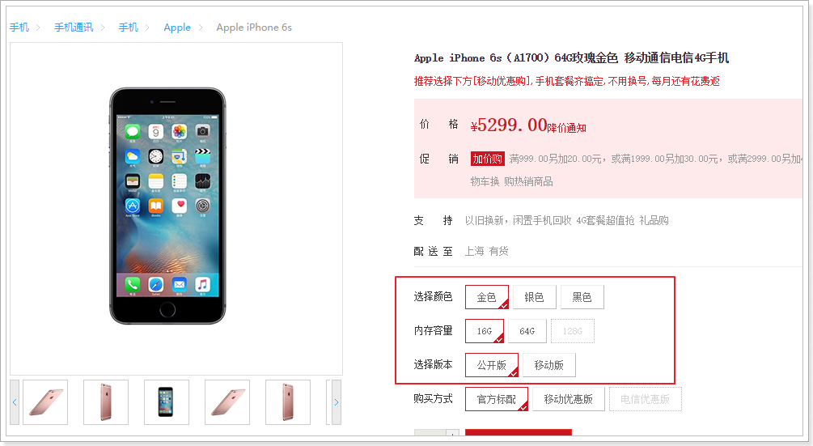
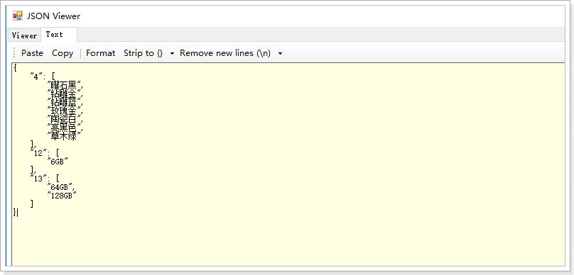
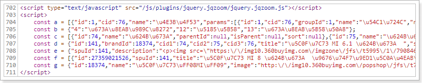
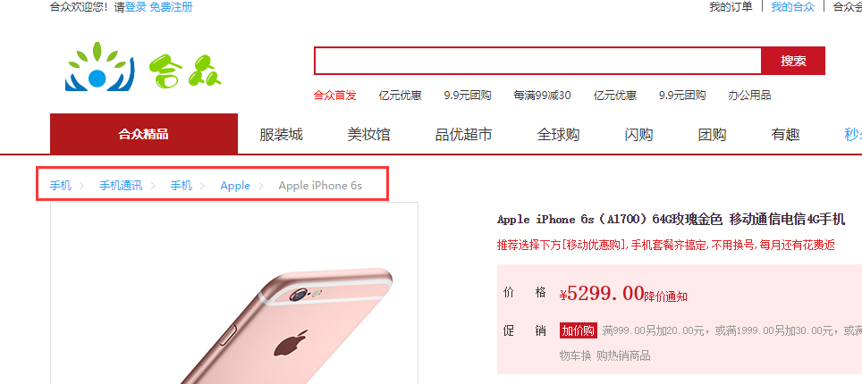
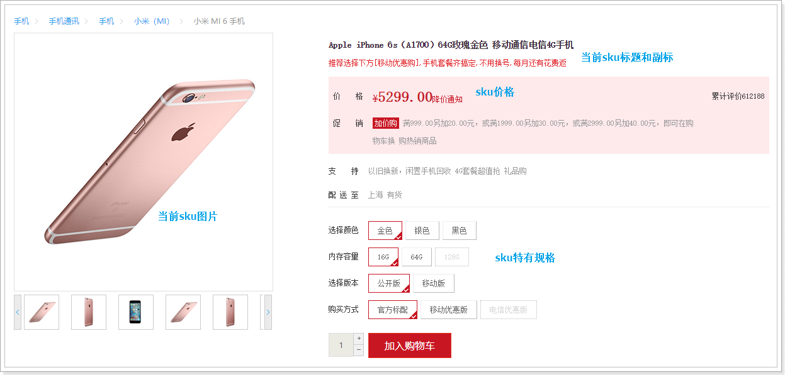
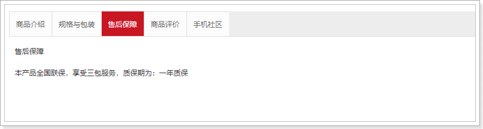

# 0.学习目标

- 了解Thymeleaf的基本使用
- 实现商品详情页的渲染
- 知道页面静态化的作用
- 实现页面静态化功能


# 1.商品详情

当用户搜索到商品，肯定会点击查看，就会进入商品详情页，接下来我们完成商品详情页的展示，

## 1.1.Thymeleaf

在商品详情页中，我们会使用到Thymeleaf来渲染页面，所以需要先了解Thymeleaf的语法。

详见课前资料中《Thymeleaf语法入门.md》


## 1.2.商品详情页服务

商品详情浏览量比较大，并发高，我们会独立开启一个微服务，用来展示商品详情。

### 1.2.1.创建module

商品的详情页服务，命名为：`hz-goods-web`


目录：


### 1.2.2.pom依赖

```xml
<?xml version="1.0" encoding="UTF-8"?>
<project xmlns="http://maven.apache.org/POM/4.0.0"
         xmlns:xsi="http://www.w3.org/2001/XMLSchema-instance"
         xsi:schemaLocation="http://maven.apache.org/POM/4.0.0 http://maven.apache.org/xsd/maven-4.0.0.xsd">
    <parent>
        <artifactId>hz</artifactId>
        <groupId>com.hz.parent</groupId>
        <version>0.0.1-SNAPSHOT</version>
    </parent>
    <modelVersion>4.0.0</modelVersion>

    <groupId>com.hz.service</groupId>
    <artifactId>hz-goods-web</artifactId>
    <version>0.0.1-SNAPSHOT</version>

    <dependencies>
        <dependency>
            <groupId>org.springframework.boot</groupId>
            <artifactId>spring-boot-starter-web</artifactId>
        </dependency>
        <dependency>
            <groupId>org.springframework.cloud</groupId>
            <artifactId>spring-cloud-starter-netflix-eureka-client</artifactId>
        </dependency>
        <dependency>
            <groupId>org.springframework.cloud</groupId>
            <artifactId>spring-cloud-starter-openfeign</artifactId>
        </dependency>
        <dependency>
            <groupId>org.springframework.boot</groupId>
            <artifactId>spring-boot-starter-thymeleaf</artifactId>
        </dependency>
        <!--引入商品模块公共信息-->
        <dependency>
            <groupId>com.hz.service</groupId>
            <artifactId>hz-item-interface</artifactId>
            <version>0.0.1-SNAPSHOT</version>
            <exclusions>
                <!--只需要接口和实体类，不需要mybatis包-->
                <exclusion>
                    <groupId>com.baomidou</groupId>
                    <artifactId>mybatis-plus-boot-starter</artifactId>
                </exclusion>
            </exclusions>
        </dependency>
    </dependencies>


</project>
```


### 1.2.3.编写启动类

```java
@SpringBootApplication
@EnableDiscoveryClient
@EnableFeignClients
public class HzGoodsWebApplication {
    public static void main(String[] args) {
        SpringApplication.run(HzGoodsWebApplication.class, args);
    }
}
```


### 1.2.4.application.yml文件

```yaml
server:
  port: 8084
spring:
  application:
    name: goods-page
  thymeleaf:
    cache: false
eureka:
  client:
    service-url:
      defaultZone: http://127.0.0.1:10086/eureka
  instance:
    lease-renewal-interval-in-seconds: 5 # 每隔5秒发送一次心跳
    lease-expiration-duration-in-seconds: 10 # 10秒不发送就过期
    prefer-ip-address: true
    ip-address: 127.0.0.1
    instance-id: ${spring.application.name}.${server.port}
```


### 1.2.5.页面模板

我们从hz-portal中复制item.html模板到当前项目resource目录下的templates中：

 


## 1.3.页面跳转

### 1.3.1.修改页面跳转路径

首先我们需要修改搜索结果页的商品地址，目前所有商品的地址都是：http://www.hz.com/item.html

 

我们应该跳转到对应的商品的详情页才对。

那么问题来了：商品详情页是一个SKU？还是多个SKU的集合？



通过详情页的预览，我们知道它是多个SKU的集合，即SPU。

所以，页面跳转时，我们应该携带SPU的id信息。

例如：http://www.hz.com/item/2314123.html

这里就采用了路径占位符的方式来传递spu的id，我们打开`search.html`，修改其中的商品路径：


刷新页面后再看：


### 1.3.2.nginx反向代理

接下来，我们要把这个地址指向我们刚刚创建的服务：`hz-goods-web`，其端口为8084

我们在nginx.conf中添加一段逻辑：


``` xml
server {
    listen       80;
    server_name  www.hz.com;

    proxy_set_header X-Forwarded-Host $host;
    proxy_set_header X-Forwarded-Server $host;
    proxy_set_header X-Forwarded-For $proxy_add_x_forwarded_for;

	location /item {
        proxy_pass http://192.168.1.114:8084;
        proxy_connect_timeout 600;
        proxy_read_timeout 600;
    }

    location / {
        proxy_pass http://192.168.1.114:9002;
        proxy_connect_timeout 600;
        proxy_read_timeout 600;
    }
   }

```


把以/item开头的请求，代理到我们的8084端口。


### 1.3.3.编写跳转controller

在`hz-goods-web`中编写controller，接收请求，并跳转到商品详情页：

```java
@Controller
@RequestMapping("item")
public class GoodsController {

    /**
     * 跳转到商品详情页
     * @param model
     * @param id
     * @return
     */
    @GetMapping("{id}.html")
    public String toItemPage(Model model, @PathVariable("id")Long id){

        return "item";
    }
}
```


### 1.3.4.测试

启动`hz-goods-page`，点击搜索页面商品，看是能够正常跳转：


现在看到的依然是静态的数据。我们接下来开始页面的渲染


## 1.4.封装模型数据

首先我们一起来分析一下，在这个页面中需要哪些数据

我们已知的条件是传递来的spu的id，我们需要根据spu的id查询到下面的数据：

- spu信息
- spu的详情
- spu下的所有sku
- 品牌
- 商品三级分类
- 商品规格参数、规格参数组


### 1.4.1.商品微服务提供接口

#### 1.4.1.1.查询spu

以上所需数据中，查询spu的接口目前还没有，我们需要在商品微服务中提供这个接口：

> GoodsApi

```java
 /**
     * 根据spu的id查询spu
     * @param id
     * @return
     */
    @GetMapping("spu/{id}")
    public Spu querySpuById(@PathVariable("id") Long id);

```

> GoodsController

```java
  @GetMapping("/spu/{id}")
    public ResponseEntity<Spu> querySpuById(@PathVariable("id") Long id){
        Spu spu = this.goodsService.querySpuById(id);
        if(spu == null){
            return new ResponseEntity<>(HttpStatus.NOT_FOUND);
        }
        return ResponseEntity.ok(spu);
    }
```

> GoodsService

```java
@Override
    public Spu querySpuById(Long id) {
        Spu spu = spuMapper.selectById(id);
        return spu;
    }
```


#### 1.4.1.2.查询规格参数组

我们在页面展示规格时，需要按组展示：


组内有多个参数，为了方便展示。我们提供一个接口，查询规格组，同时在规格组中持有组内的所有参数。

> 拓展`SpecGroup`类：

我们在`SpecGroup`中添加一个`SpecParam`的集合，保存该组下所有规格参数

```java
@TableName("tb_spec_group")
@Data
public class SpecGroup {

    @TableId(type = IdType.AUTO)
    private int id;

    private int cid;
    private String name;

    @TableField(exist = false) //不参与数据库操作
    private List<SpecParam> params; // 该组下的所有规格参数集合
}

```

然后提供查询接口：

> SpecificationAPI：

```java
public interface SpecificationApi {
    @GetMapping("/groups/{cid}")
    public List<SpecGroup> findById(@PathVariable("cid") int cid);

    @GetMapping("/params")
    public List<SpecParam> findParmaById(@RequestParam(value = "gid",required = false) Long gid, @RequestParam(value = "cid",required = false) Long cid);

    @PostMapping("/param")
    public int save(@RequestBody SpecParam specParam);

    // 查询规格参数组，及组内参数
    @GetMapping("{cid}")
    List<SpecGroup> querySpecsByCid(@PathVariable("cid") Long cid);

}

```

> SpecificationController

```java
 /**
     *  查询规格参数组，及组内参数
     */
 @GetMapping("{cid}")
 public ResponseEntity<List<SpecGroup>> querySpecsByCid(@PathVariable("cid") Long cid){
     List<SpecGroup> list = this.specGroupService.querySpecsByCid(cid);
     if(list == null || list.size() == 0){
         System.out.println("spec下没有对应参数....");
         return new ResponseEntity<>(HttpStatus.NOT_FOUND);
     }
     return ResponseEntity.ok(list);
 }
```

> SpecificationService

```java
 @Override
    public List<SpecGroup> findByCid(Long cid) {
        QueryWrapper<SpecGroup> query = new QueryWrapper<>();
        query.eq("cid",cid);
        List<SpecGroup> specGroups = specGroupMapper.selectList(query);
        return specGroups;
    }

    @Override
    public List<SpecGroup> querySpecsByCid(Long cid) {
        List<SpecGroup> specGroups = findByCid(cid);
        for (SpecGroup specGroup : specGroups) {
            //通过goup_id获取 param列表
            QueryWrapper<SpecParam> query = new QueryWrapper<>();
            query.eq("group_id",specGroup.getId());
            List<SpecParam> params = specParamMapper.selectList(query);
            specGroup.setParams(params);
        }
        return specGroups;
    }
```

在service中，我们调用之前编写过的方法，查询规格组，和规格参数，然后封装返回。

http://localhost:8081/spec/76


### 1.4.2.创建FeignClient

我们在`hz-goods-web`服务中，创建FeignClient：


BrandClient：

```java
@FeignClient("item-service")
public interface BrandClient extends BrandApi {
}
```

CategoryClient

```java
@FeignClient("item-service")
public interface CategoryClient extends CategoryApi {
}
```

GoodsClient:

```java
@FeignClient("item-service")
public interface GoodsClient extends GoodsApi {
}
```

SpecificationClient：

```java
@FeignClient(value = "item-service")
public interface SpecificationClient extends SpecificationApi{
}
```


### 1.4.3.封装数据模型

我们创建一个GoodsService，在里面来封装数据模型。

这里要查询的数据：

- SPU

- SpuDetail

- SKU集合

- 商品分类

  - 这里值需要分类的id和name就够了，因此我们查询到以后自己需要封装数据

- 品牌

- 规格组

  - 查询规格组的时候，把规格组下所有的参数也一并查出，上面提供的接口中已经实现该功能，我们直接调

- sku的特有规格参数

  有了规格组，为什么这里还要查询？

  因为在SpuDetail中的SpecialSpec中，是以id作为规格参数id作为key，如图：

  

  但是，在页面渲染时，需要知道参数的名称.

  我们就需要把id和name一一对应起来，因此需要额外查询sku的特有规格参数，然后变成一个id:name的键值对格式。也就是一个Map，方便将来根据id查找！


> Service代码

```java
package com.hz.goods.service.impl;

@Service
public class GoodsServiceImpl implements IGoodsService {


    @Autowired
    private GoodsClient goodsClient;

    @Autowired
    private BrandClient brandClient;

    @Autowired
    private CategoryClient categoryClient;

    @Autowired
    private SpecificationClient specificationClient;

    private static final Logger logger = LoggerFactory.getLogger(GoodsServiceImpl.class);

    public Map<String, Object> loadModel(Long spuId){

        try {
            // 查询spu
            Spu spu = this.goodsClient.querySpuById(spuId);

            // 查询spu详情
            SpuDetail spuDetail = this.goodsClient.findSpuDetailBySpuId(spuId);

            // 查询sku
            List<Sku> skus = this.goodsClient.findSkusBySpuid(spuId);

            // 查询品牌
            List<Brand> brands = this.brandClient.queryBrandByIds(spu.getBrandId());

            // 查询分类
            List<Category> categories = getCategories(spu);

            // 查询组内参数
            List<SpecGroup> specGroups = this.specificationClient.querySpecsByCid(spu.getCid3());

            // 查询所有特有规格参数
            //false:表示特有
            List<SpecParam> specParams = specificationClient.findParmaById(null, spu.getCid3(), false);

            // 处理规格参数
            Map<Long, String> paramMap = new HashMap<>();
            for (SpecParam param : specParams) {
                paramMap.put(param.getId(), param.getName());
            }


            Map<String, Object> map = new HashMap<>();
            map.put("spu", spu);
            map.put("spuDetail", spuDetail);
            map.put("skus", skus);
            map.put("brand", brands.get(0));
            map.put("categories", categories);
            map.put("groups", specGroups);
            map.put("params", paramMap);
            return map;
        } catch (Exception e) {
            logger.error("加载商品数据出错,spuId:{}", spuId, e);
        }
        return null;
    }

    private List<Category> getCategories(Spu spu) {
        try {
            List<String> names = this.categoryClient.queryNameByIds(
                    Arrays.asList(spu.getCid1(), spu.getCid2(), spu.getCid3()));
            Category c1 = new Category();
            c1.setName(names.get(0));
            long cid1 = spu.getCid1();
            c1.setId((int)cid1);

            Category c2 = new Category();
            c2.setName(names.get(1));
            long cid2 = spu.getCid2();
            c2.setId((int)cid2);

            Category c3 = new Category();
            c3.setName(names.get(2));
            long cid3 = spu.getCid3();
            c3.setId((int)cid3);
            return Arrays.asList(c1, c2, c3);
        } catch (Exception e) {
            logger.error("查询商品分类出错，spuId：{}", spu.getId(), e);
        }
        return null;
    }
}

```


然后在controller中把数据放入model：

```java
@Controller
@RequestMapping("item")
public class GoodsController {

    @Autowired
    private GoodsService goodsService;
    /**
     * 跳转到商品详情页
     * @param model
     * @param id
     * @return
     */
    @GetMapping("{id}.html")
    public String toItemPage(Model model, @PathVariable("id")Long id){
        // 加载所需的数据
        Map<String, Object> modelMap = this.goodsService.loadModel(id);
        // 放入模型
        model.addAllAttributes(modelMap);
        return "item";
    }
}
```

### 1.4.4.页面测试数据

我们在页面中先写一段JS，把模型中的数据取出观察，看是否成功：

```html
<script th:inline="javascript">
    const a = /*[[${groups}]]*/ [];
    const b = /*[[${params}]]*/ [];
    const c = /*[[${categories}]]*/ [];
    const d = /*[[${spu}]]*/ {};
    const e = /*[[${spuDetail}]]*/ {};
    const f = /*[[${skus}]]*/ [];
    const g = /*[[${brand}]]*/ {};
</script>
```

然后查看页面源码：



数据都成功查到了！


## 1.5.渲染面包屑

在商品展示页的顶部，有一个商品分类、品牌、标题的面包屑



其数据有3部分：

- 商品分类
- 商品品牌
- spu标题

我们的模型中都有，所以直接渲染即可（页面101行开始）：

```html
<div class="crumb-wrap">
    <ul class="sui-breadcrumb">
        <li th:each="category : ${categories}">
            <a href="#" th:text="${category.name}">手机</a>
        </li>
        <li>
            <a href="#" th:text="${brand.name}">Apple</a>
        </li>
        <li class="active" th:text="${spu.title}">Apple iPhone 6s</li>
    </ul>
</div>
```


## 1.6.渲染商品列表

先看下整体效果：



这个部分需要渲染的数据有5块：

- sku图片
- sku标题
- 副标题
- sku价格
- 特有规格属性列表

其中，sku 的图片、标题、价格，都必须在用户选中一个具体sku后，才能渲染。而特有规格属性列表可以在spuDetail中查询到。而副标题则是在spu中，直接可以在页面渲染

因此，我们先对特有规格属性列表进行渲染。等用户选择一个sku，再通过js对其它sku属性渲染

### 1.6.1.副标题

副标题是在spu中，所以我们直接通过Thymeleaf渲染：

在第146行左右：

```html
<div class="news"><span th:utext="${spu.subTitle}"></span></div>
```

副标题中可能会有超链接，因此这里也用`th:utext`来展示，效果：


### 1.6.2.渲染规格属性列表

规格属性列表将来会有事件和动态效果。我们需要有js代码参与，不能使用Thymeleaf来渲染了。

因此，这里我们用vue，不过需要先把数据放到js对象中，方便vue使用

#### 初始化数据

我们在页面的`head`中，定义一个js标签，然后在里面定义变量，保存与sku相关的一些数据：

```html
<script th:inline="javascript">
    // sku集合
    const skus = /*[[${skus}]]*/ [];
    // 规格参数id与name对
	const paramMap = /*[[${params}]]*/ {};
    // 特有规格参数集合
    const specialSpec = JSON.parse(/*[[${spuDetail.specialSpec}]]*/ "");
</script>
```

- specialSpec：这是SpuDetail中唯一与Sku相关的数据

  因此我们并没有保存整个spuDetail，而是只保留了这个属性，而且需要手动转为js对象。

- paramMap：规格参数的id和name对，方便页面根据id获取参数名

- sku：特有规格参数集合

我们来看下页面获取的数据：


#### 通过Vue渲染

我们把刚才获得的几个变量保存在Vue实例中：


然后在页面中渲染：

```html
<div id="specification" class="summary-wrap clearfix">
    <dl v-for="(v,k) in specialSpec" :key="k">
        <dt>
            <div class="fl title">
                <i>{{paramMap[k]}}</i>
            </div>
        </dt>
        <dd v-for="(str,j) in v" :key="j">
            <a href="javascript:;" class="selected">
                {{str}}<span title="点击取消选择">&nbsp;</span>
            </a>
        </dd>
    </dl>
</div>
```

然后刷新页面查看：


数据成功渲染了。不过我们发现所有的规格都被勾选了。这是因为现在，每一个规格都有样式：`selected`，我们应该只选中一个，让它的class样式为selected才对！


那么问题来了，我们该如何确定用户选择了哪一个？


### 1.6.3.规格属性的筛选

#### 分析

规格参数的格式是这样的：

 

每一个规格项是数组中的一个元素，因此我们只要保存被选择的规格项的索引，就能判断哪个是用户选择的了！

我们需要一个对象来保存用户选择的索引，格式如下：

```js
{
    "4":0,
    "12":0,
    "13":0
}
```

但问题是，第一次进入页面时，用户并未选择任何参数。因此索引应该有一个默认值，我们将默认值设置为0。

我们在`head`的script标签中，对索引对象进行初始化：

``` javascript
 // 初始化索引对象
 const indexes = {};
 for(let s in paramMap){
     indexes[s] = 0;
 }
```


然后在vue中保存：

``` html
<script>
    var itemVm = new Vue({
        el: "#itemApp",
        data: {
            ly,
            skus,
            paramMap,
            specialSpec,
            indexes
        },
        components: {
            lyTop: () => import('/js/pages/top.js')
        }
    });
</script>
```


#### 页面改造

我们在页面中，通过判断indexes的值来判断当前规格是否被选中，并且给规格绑定点击事件，点击规格项后，修改indexes中的对应值：

```html
<div id="specification" class="summary-wrap clearfix">
    <dl v-for="(v,k) in specialSpec" :key="k">
        <dt>
            <div class="fl title">
                <i>{{paramMap[k]}}</i>
            </div>
        </dt>
        <dd v-for="(str,j) in v" :key="j">
            <a href="javascript:;" :class="{selected: j===indexes[k]}" @click="indexes[k]=j">
                {{str}}<span v-if="j===indexes[k]" title="点击取消选择">&nbsp;</span>
            </a>
        </dd>
    </dl>
</div>
```


效果：


### 1.6.4.确定SKU

在我们设计sku数据的时候，就已经添加了一个字段：indexes：


这其实就是规格参数的索引组合。

而我们在页面中，用户点击选择规格后，就会把对应的索引保存起来：


因此，我们可以根据这个indexes来确定用户要选择的sku

我们在vue中定义一个**计算属性**，来计算与索引匹配的sku：

```js
computed:{
    sku(){
        //拼接当前index
        const index = Object.values(this.indexes).join("_");
        for(var i in skus){
            if(this.skus[i].indexes ===index ) //如果相同证明获取一样的数据
            {
                return skus[i];
            }
          }
       }
    }
```

在浏览器工具中查看：


### 1.6.5.渲染sku列表

既然已经拿到了用户选中的sku，接下来，就可以在页面渲染数据了

#### 图片列表

商品图片是一个字符串，以`,`分割，页面展示比较麻烦，所以我们编写一个**计算属性**:images()，将图片字符串变成数组：

```js
 computed:{
    sku(){
        //拼接当前index
        const index = Object.values(this.indexes).join("_");
        for(var i in skus){
            if(this.skus[i].indexes ===index ) //如果相同证明获取一样的数据
            {
                return skus[i];
            }
        }
    },
    images(){
        return this.sku.images ? this.sku.images.split(",") : [''];
    }
}
```


页面改造：

```html
<div class="zoom">
   <!--默认第一个预览-->
   <div id="preview" class="spec-preview">
      <span class="jqzoom">
         
      </span>
   </div>
   <!--下方的缩略图-->
   <div class="spec-scroll">
      <a class="prev">&lt;</a>
      <!--左右按钮-->
      <div class="items">
         <ul>
            <li v-for="(image, i) in images" :key="i">
               
            </li>
         </ul>
      </div>
      <a class="next">&gt;</a>
   </div>
</div>
```

效果：


#### 标题和价格


#### 完整效果


## 1.7.商品详情

商品详情页面如下图所示：


分成上下两部分：

- 上部：展示的是规格属性列表
- 下部：展示的是商品详情


### 1.7.2.商品详情

商品详情是HTML代码，我们不能使用 `th:text`，应该使用`th:utext`

在页面的第444行左右：

```html
<!--商品详情-->
<div class="intro-detail" th:utext="${spuDetail.description}">
</div>
```

最终展示效果：


## 1.8.规格包装：

规格包装分成两部分：

- 规格参数
- 包装列表

而且规格参数需要按照组来显示

### 1.8.1.规格参数

最终的效果：


我们模型中有一个groups，跟这个数据结果很像：

 

分成8个组，组内都有params，里面是所有的参数。不过，这些参数都没有值！

规格参数的值分为两部分：

- 通用规格参数：保存在SpuDetail中的genericSpec中
- 特有规格参数：保存在sku的ownSpec中

我们需要把这两部分值取出来，放到groups中。


从spuDetail中取出genericSpec并取出groups：

``` xml
 const myGroups = [[${groups}]];
```


把genericSpec引入到Vue实例：

``` javascript
 var itemVm = new Vue({
        el: "#itemApp",
        data: {
            ly,
            skus,
            paramMap,
            specialSpec,
            indexes,
            myGroups,
            spuDetail
        },
```


因为sku是动态的，所以我们编写一个**计算属性**，来进行值的组合：

```js
groups(){
   this.myGroups.forEach(group => {
       group.params.forEach(param => {
           var gen = JSON.parse(this.spuDetail.genericSpec);
           var spec = JSON.parse(this.spuDetail.specialSpec);
            if(param.generic){
                // 通用属性，去spu的genericSpec中获取
                param.v = gen[param.id] || '其它';
            }else{
                // 特有属性值，去SKU中获取
                param.v = spec[param.id];
            }
        })
     })
     return this.myGroups;
 }
```

然后在页面渲染：

```html
<div class="Ptable">
  <div class="Ptable-item" v-for="group in groups" :key="group.name">
      <h3>{{group.name}}</h3>
      <dl>
           <div v-for="p in group.params">
               <dt>{{p.name}}</dt><dd>{{p.v + (p.unit || '')}}</dd>
           </div>
       </dl>
   </div>
</div>
```

### 1.8.2.包装列表

包装列表在商品详情中，我们一开始并没有赋值到Vue实例中，但是可以通过Thymeleaf来渲染

```html
<div class="package-list">
    <h3>包装清单</h3>
    <p th:text="${spuDetail.packingList}"></p>
</div>
```


最终效果：


## 1.9.售后服务

售后服务也可以通过Thymeleaf进行渲染：

```html
<div id="three" class="tab-pane">
    <p>售后保障</p>
    <p th:text="${spuDetail.afterService}"></p>
</div>
```

效果：




