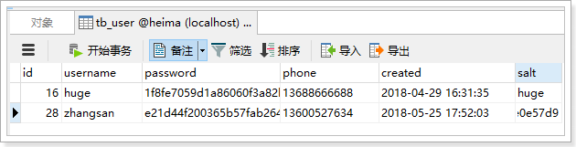
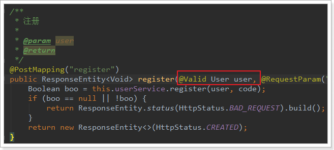
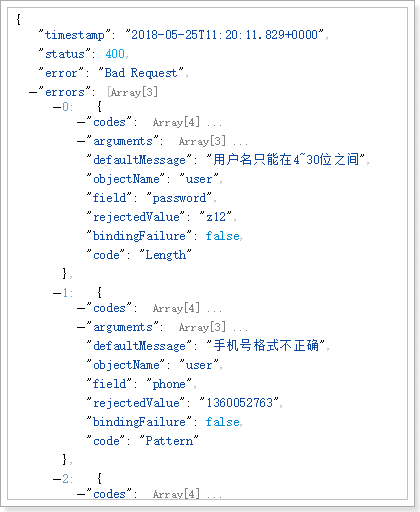

# 0.学习目标

- 独立创建用户中心
- 了解面向接口开发方式
- 实现数据校验功能
- 实现短信发送功能
- 实现注册功能
- 实现根据用户名和密码查询用户功能


# 1.创建用户中心

用户搜索到自己心仪的商品，接下来就要去购买，但是购买必须先登录。所以接下来我们编写用户中心，实现用户的登录和注册功能。

用户中心的提供的服务：

- 用户的注册
- 用户登录
- 用户个人信息管理
- 用户地址管理
- 用户收藏管理
- 我的订单
- 优惠券管理

这里我们暂时先实现基本的：`注册和登录`功能，其它功能大家可以自行补充完整。

因为用户中心的服务其它微服务也会调用，因此这里我们做聚合。

hz-user：父工程，包含2个子工程：
- hz-user-interface：实体及接口
- hz-user-service：业务和服务


## 1.1.创建父module  hz-user

hz-user

## 1.2.创建hz-user-interface

在hz-user下，创建module：

pom.xml

``` xml
<?xml version="1.0" encoding="UTF-8"?>
<project xmlns="http://maven.apache.org/POM/4.0.0"
         xmlns:xsi="http://www.w3.org/2001/XMLSchema-instance"
         xsi:schemaLocation="http://maven.apache.org/POM/4.0.0 http://maven.apache.org/xsd/maven-4.0.0.xsd">
    <parent>
        <artifactId>hz-user</artifactId>
        <groupId>com.hz.service</groupId>
        <version>0.0.1-SNAPSHOT</version>
    </parent>
    <modelVersion>4.0.0</modelVersion>

    <groupId>com.hz.service</groupId>
    <artifactId>hz-user-interface</artifactId>
    <version>0.0.1-SNAPSHOT</version>
    <dependencies>
        <dependency>
            <groupId>org.projectlombok</groupId>
            <artifactId>lombok</artifactId>
        </dependency>

        <dependency>
            <groupId>com.baomidou</groupId>
            <artifactId>mybatis-plus-boot-starter</artifactId>
        </dependency>

        <dependency>
            <groupId>org.springframework.boot</groupId>
            <artifactId>spring-boot-starter-web</artifactId>
        </dependency>

        <dependency>
            <groupId>com.hz.common</groupId>
            <artifactId>hz-common</artifactId>
            <version>0.0.1-SNAPSHOT</version>
        </dependency>
        <dependency>
            <groupId>org.hibernate.validator</groupId>
            <artifactId>hibernate-validator</artifactId>
        </dependency>
    </dependencies>

</project>
```


## 1.3.创建hz-user-service

创建module

pom

```xml
<?xml version="1.0" encoding="UTF-8"?>
<project xmlns="http://maven.apache.org/POM/4.0.0"
         xmlns:xsi="http://www.w3.org/2001/XMLSchema-instance"
         xsi:schemaLocation="http://maven.apache.org/POM/4.0.0 http://maven.apache.org/xsd/maven-4.0.0.xsd">
    <parent>
        <artifactId>hz-user</artifactId>
        <groupId>com.hz.service</groupId>
        <version>0.0.1-SNAPSHOT</version>
    </parent>
    <modelVersion>4.0.0</modelVersion>

    <groupId>com.hz.service</groupId>
    <artifactId>hz-user-service</artifactId>
    <version>0.0.1-SNAPSHOT</version>

    <dependencies>
        <dependency>
            <groupId>org.springframework.boot</groupId>
            <artifactId>spring-boot-starter-web</artifactId>
        </dependency>
        <dependency>
            <groupId>org.springframework.cloud</groupId>
            <artifactId>spring-cloud-starter-netflix-eureka-client</artifactId>
        </dependency>
        <dependency>
            <groupId>org.springframework.boot</groupId>
            <artifactId>spring-boot-starter-jdbc</artifactId>
        </dependency>

        <dependency>
            <groupId>com.baomidou</groupId>
            <artifactId>mybatis-plus-boot-starter</artifactId>
        </dependency>

        <!-- mysql驱动 -->
        <dependency>
            <groupId>mysql</groupId>
            <artifactId>mysql-connector-java</artifactId>
        </dependency>
        <dependency>
            <groupId>com.hz.service</groupId>
            <artifactId>hz-user-interface</artifactId>
            <version>0.0.1-SNAPSHOT</version>
        </dependency>
        <dependency>
            <groupId>com.hz.common</groupId>
            <artifactId>hz-common</artifactId>
            <version>${hz.latest.version}</version>
        </dependency>

        <dependency>
            <groupId>org.springframework.boot</groupId>
            <artifactId>spring-boot-starter-actuator</artifactId>
        </dependency>

        <dependency>
            <groupId>org.springframework.boot</groupId>
            <artifactId>spring-boot-starter-data-redis</artifactId>
        </dependency>
        <dependency>
            <groupId>org.springframework.boot</groupId>
            <artifactId>spring-boot-starter-amqp</artifactId>
        </dependency>

    </dependencies>

</project>
```


启动类

```java
@SpringBootApplication
@EnableDiscoveryClient
@MapperScan("com.hz.user.mapper")
public class hzUserApplication {

    public static void main(String[] args) {
        SpringApplication.run(hzUserApplication.class, args);
    }
}
```


配置：

```yaml
server:
  port: 8085
spring:
  application:
    name: user-service
  datasource:
    url: jdbc:mysql://127.0.0.1:3306/hz?characterEncoding=UTF-8&useSSL=false
    username: root
    password: root
    hikari:
      maximum-pool-size: 20
      minimum-idle: 10
  # redis配置
  redis:
    port: 6379
    host: 192.168.1.109
    password: 123
  rabbitmq:
    host: 127.0.0.1
    port: 5672
    username: guest
    password: guest
    template:
          retry:
            enabled: true
            initial-interval: 10000ms
            max-interval: 210000ms
            multiplier: 2
    publisher-confirms: true

  #配置值rabbit

eureka:
  client:
    service-url:
      defaultZone: http://127.0.0.1:10086/eureka
    registry-fetch-interval-seconds: 5
  instance:
    instance-id: ${spring.application.name}:${server.port}
    prefer-ip-address: true  #当你获取host时，返回的不是主机名，而是ip
    ip-address: 127.0.0.1
    lease-renewal-interval-in-seconds: 5
    lease-expiration-duration-in-seconds: 15
ribbon:
  ConnectTimeout: 250 # 连接超时时间(ms)
  ReadTimeout: 2000 # 通信超时时间(ms)
  OkToRetryOnAllOperations: true # 是否对所有操作重试
  MaxAutoRetriesNextServer: 1 # 同一服务不同实例的重试次数
  MaxAutoRetries: 1 # 同一实例的重试次数
hystrix:
  command:
    default:
      execution:
        isolation:
          thread:
            timeoutInMillisecond: 10000 # 熔断超时时长：10000ms

info:
 app.name:  item-service
 company.name:  www.hz.com
 build.artifactId:  $project.artifactId$
 build.version:  $project.version$
logging:
  level:
    com.hz.user.mapper: debug
mybatis:
  configuration:
   map-underscore-to-camel-case: true #开启驼峰命名规则


```


## 1.4.添加网关路由

我们修改`hz-gateway`，添加路由规则，对`hz-user-service`进行路由:


# 2.后台功能准备


## 2.1.接口文档

整个用户中心的开发，我们将模拟公司内面向接口的开发。

现在假设项目经理已经设计好了接口文档，详见：《用户中心接口说明.md》


我们将根据文档直接编写后台功能，不关心页面实现。


## 2.2.数据结构

```mysql
CREATE TABLE `tb_user` (
  `id` bigint(20) NOT NULL AUTO_INCREMENT,
  `username` varchar(50) NOT NULL COMMENT '用户名',
  `password` varchar(128) NOT NULL COMMENT '密码，加密存储',
  `phone` varchar(20) DEFAULT NULL COMMENT '注册手机号',
  `created` datetime NOT NULL COMMENT '创建时间',
  `salt` varchar(32) NOT NULL COMMENT '密码加密的salt值',
  PRIMARY KEY (`id`),
  UNIQUE KEY `username` (`username`) USING BTREE
) ENGINE=InnoDB AUTO_INCREMENT=28 DEFAULT CHARSET=utf8 COMMENT='用户表';
```

数据结构比较简单，因为根据用户名查询的频率较高，所以我们给用户名创建了索引


## 2.3.基本代码

### 2.3.1.实体类

```java

@TableName("tb_user")
@Data
public class User {

    @TableId(type = IdType.AUTO)
    private Long id;
    @Length(min = 4, max = 30, message = "用户名只能在4~30位之间")
    private String username;// 用户名

    @JsonIgnore
    @Length(min = 4, max = 30, message = "密码只能在4~30位之间")
    private String password;// 密码

    @Pattern(regexp = "^1[35678]\\d{9}$", message = "手机号格式不正确")
    private String phone;// 电话

    private Date created;// 创建时间

    @JsonIgnore
    private String salt;// 密码的盐值

}
```

注意：为了安全考虑。这里对password和salt添加了注解@JsonIgnore，这样在json序列化时，就不会把password和salt返回。


# 3.数据验证功能


## 3.1.接口说明

实现用户数据的校验，主要包括对：手机号、用户名的唯一性校验。

**接口路径：**

```
GET /check/{data}/{type}
```

**参数说明：**

| 参数 | 说明                                   | 是否必须 | 数据类型 | 默认值 |
| ---- | -------------------------------------- | -------- | -------- | ------ |
| data | 要校验的数据                           | 是       | String   | 无     |
| type | 要校验的数据类型：1，用户名；2，手机； | 否       | Integer  | 1      |

**返回结果：**

返回布尔类型结果：

- true：可用
- false：不可用

状态码：

- 200：校验成功
- 400：参数有误
- 500：服务器内部异常


## 3.2.controller

因为有了接口，我们可以不关心页面，所有需要的东西都一清二楚：

- 请求方式：GET
- 请求路径：/check/{param}/{type}
- 请求参数：param,type
- 返回结果：true或false

```java
 /**
     * 校验数据是否可用
     * @param data
     * @param type
     * @return
     */
    @GetMapping("check/{data}/{type}")
    public ResponseEntity<Boolean> checkUserData(@PathVariable("data") String data, @PathVariable(value = "type") Integer type) {
        Boolean boo = this.userService.checkData(data, type);
        if (boo == null) {
            return ResponseEntity.status(HttpStatus.BAD_REQUEST).build();
        }
        return ResponseEntity.ok(boo);
    }
```

## 3.3.Service

```java
 @Override
    public Boolean checkData(String data, Integer type) {

        QueryWrapper<User> queryWrapper = new QueryWrapper();
        switch (type) {
            case 1:
                queryWrapper.eq("username",data);
                break;
            case 2:
                queryWrapper.eq("phone",data);
                break;
            default:
                return null;
        }

        int count = userMapper.selectCount(queryWrapper);
        return count==0;
    }
```


## 3.4.测试

我们在数据库插入一条假数据：


然后在浏览器调用接口，测试：


# 4.阿里大于短信服务


## 4.1.demo

注册页面上有短信发送的按钮，当用户点击发送短信，我们需要生成验证码，发送给用户。我们将使用阿里提供的阿里大于来实现短信发送。

参考课前资料的《阿里短信.md》学习demo入门


## 4.2.创建短信微服务

因为系统中不止注册一个地方需要短信发送，因此我们将短信发送抽取为微服务：`hz-sms-service`，凡是需要的地方都可以使用。

另外，因为短信发送API调用时长的不确定性，为了提高程序的响应速度，短信发送我们都将采用异步发送方式，即：

- 短信服务监听MQ消息，收到消息后发送短信。
- 其它服务要发送短信时，通过MQ通知短信微服务。


### 4.2.1.创建module

**hz-sms**


### 4.2.2.pom

```xml
<?xml version="1.0" encoding="UTF-8"?>
<project xmlns="http://maven.apache.org/POM/4.0.0"
         xmlns:xsi="http://www.w3.org/2001/XMLSchema-instance"
         xsi:schemaLocation="http://maven.apache.org/POM/4.0.0 http://maven.apache.org/xsd/maven-4.0.0.xsd">
    <parent>
        <artifactId>hz</artifactId>
        <groupId>com.hz.parent</groupId>
        <version>0.0.1-SNAPSHOT</version>
    </parent>
    <modelVersion>4.0.0</modelVersion>

    <groupId>com.hz.service</groupId>
    <artifactId>hz-sms</artifactId>
    <version>0.0.1-SNAPSHOT</version>


    <dependencies>

        <dependency>
            <groupId>com.aliyun</groupId>
            <artifactId>aliyun-java-sdk-core</artifactId>
            <version>4.1.0</version>
        </dependency>

        <dependency>
            <groupId>org.springframework.boot</groupId>
            <artifactId>spring-boot-starter-web</artifactId>
        </dependency>

        <dependency>
            <groupId>org.projectlombok</groupId>
            <artifactId>lombok</artifactId>
        </dependency>
        <dependency>
            <groupId>org.springframework.boot</groupId>
            <artifactId>spring-boot-starter-amqp</artifactId>
        </dependency>


    </dependencies>
</project>
```


### 4.2.3.编写启动类

```java
@SpringBootApplication
public class SmsApplication {
    public static void main(String[] args) {
        SpringApplication.run(SmsApplication.class, args);
    }
}
```


### 4.2.4.编写application.yml

```yaml
# 配置短信相关信息
hz:
  sms:
    acessKeyId: LTAIHsLVzSBm2G8a
    accessKeySecret: 99CL6YJY260YF07Vu6JLr8J7qxq1IV
    signName: 合众商城
    templateCode:  SMS_169904124

# 配置rabbitMQ
spring:
  rabbitmq:
    host: 127.0.0.1
    port: 5672
    username: guest
    password: guest
```

## 4.3.编写短信工具类

### 4.3.1.属性抽取

我们首先把一些常量抽取到application.yml中：

```yaml
hz:
  sms:
    acessKeyId: LTAIHsLVzSBm2G8a
    accessKeySecret: 99CL6YJY260YF07Vu6JLr8J7qxq1IV
    signName: 合众商城
    templateCode:  SMS_169904124
```

然后注入到属性类中：

```java
@Component
@ConfigurationProperties(prefix = "hz.sms")
@Data
public class SMSProperties {

    private String acessKeyId; //账号id
    private String accessKeySecret; //账号场景值
    private String signName; //账户签名
    private String templateCode;//短信模板设计
}

```


### 4.3.2.工具类

我们把阿里提供的demo进行简化和抽取，封装一个工具类：

```java
@Component
public class SmsUtils {


    @Autowired
    private SMSProperties smsProperties;


    public CommonResponse sendSms( String phone,  String text) {
        DefaultProfile profile = DefaultProfile.getProfile("default", smsProperties.getAcessKeyId(), smsProperties.getAccessKeySecret());
        IAcsClient client = new DefaultAcsClient(profile);

        CommonRequest request = new CommonRequest();
        request.setMethod(MethodType.POST);
        request.setDomain("dysmsapi.aliyuncs.com");
        request.setVersion("2017-05-25");
        request.setAction("SendSms");

        request.putQueryParameter("PhoneNumbers", phone);
        request.putQueryParameter("SignName", smsProperties.getSignName());
        request.putQueryParameter("TemplateCode", smsProperties.getTemplateCode());
        request.putQueryParameter("TemplateParam", "{\"code\":\""+text+"\"}");
        try {
            CommonResponse response = client.getCommonResponse(request);
            System.out.println(response.getData());
            return response;
        } catch (ServerException e) {
            e.printStackTrace();
        } catch (ClientException e) {
            e.printStackTrace();
        }
        return null;
    }

}

```


## 4.4.编写消息监听器

接下来，编写消息监听器，当接收到消息后，我们发送短信。

```java
@Component
//@EnableConfigurationProperties(SMSProperties.class)
public class SmsListener {

    @Autowired
    private SmsUtils smsUtils;

    @Autowired
    private SMSProperties prop;


    /**
     * @param msg :解码后的消息
     * @param deliveryTag :使用@Header接口获取messageProperties中的DELIVERY_TAG属性。
     * @param channel : 接受消息所使用的信道
     */
    @RabbitListener(bindings = @QueueBinding(
            value = @Queue(value = "hz.sms.queue", durable = "true"),
            exchange = @Exchange(value = "hz.sms.exchange",
                    ignoreDeclarationExceptions = "true"),
            key = {"sms.verify.code"}))
    public void listenSms(@Payload Map<String, String> msg, @Header(AmqpHeaders.DELIVERY_TAG) long deliveryTag, Channel channel) throws Exception {
        if (msg == null || msg.size() <= 0) {
            // 放弃处理
            return;
        }
        String phone = msg.get("phone");
        String code = msg.get("code");

        if (StringUtils.isEmpty(phone) || StringUtils.isEmpty(code)) {
            // 放弃处理
            return;
        }
        // 发送消息

        //手动确认消息
        channel.basicAck(deliveryTag,false);
        System.out.print("这里是接收者1答应消息： ");

        CommonResponse response = this.smsUtils.sendSms(phone, code);
        // 发送失败
        //throw new RuntimeException();
    }
}
```


我们注意到，消息体是一个Map，里面有两个属性：

- phone：电话号码
- code：短信验证码

## 4.5.启动

启动项目，然后查看RabbitMQ控制台，发现交换机已经创建：

 

队列也已经创建：


并且绑定：

 


# 5.发送短信功能


短信微服务已经准备好，我们就可以继续编写用户中心接口了。

## 5.1.接口说明


这里的业务逻辑是这样的：

- 1）我们接收页面发送来的手机号码
- 2）生成一个随机验证码
- 3）将验证码保存在服务端
- 4）发送短信，将验证码发送到用户手机


那么问题来了：验证码保存在哪里呢？

验证码有一定有效期，一般是5分钟，我们可以利用Redis的过期机制来保存。

## 5.2.Redis

### 5.2.1.安装

参考课前资料中的：《centos下的redis安装配置.md》


### 5.2.2.Spring Data Redis

官网：<http://projects.spring.io/spring-data-redis/>

                                     

Spring Data Redis，是Spring Data 家族的一部分。 对Jedis客户端进行了封装，与spring进行了整合。可以非常方便的来实现redis的配置和操作。 

### 5.2.3.RedisTemplate基本操作

Spring Data Redis 提供了一个工具类：RedisTemplate。里面封装了对于Redis的五种数据结构的各种操作，包括：

- redisTemplate.opsForValue() ：操作字符串
- redisTemplate.opsForHash() ：操作hash
- redisTemplate.opsForList()：操作list
- redisTemplate.opsForSet()：操作set
- redisTemplate.opsForZSet()：操作zset

其它一些通用命令，如expire，可以通过redisTemplate.xx()来直接调用

5种结构：

- String：等同于java中的，`Map<String,String>`
- list：等同于java中的`Map<String,List<String>>`
- set：等同于java中的`Map<String,Set<String>>`
- sort_set：可排序的set
- hash：等同于java中的：`Map<String,Map<String,String>>


### 5.2.4.StringRedisTemplate

RedisTemplate在创建时，可以指定其泛型类型：

- K：代表key 的数据类型
- V: 代表value的数据类型

注意：这里的类型不是Redis中存储的数据类型，而是Java中的数据类型，RedisTemplate会自动将Java类型转为Redis支持的数据类型：字符串、字节、二进制等等。


不过RedisTemplate默认会采用JDK自带的序列化（Serialize）来对对象进行转换。生成的数据十分庞大，因此一般我们都会指定key和value为String类型，这样就由我们自己把对象序列化为json字符串来存储即可。


因为大部分情况下，我们都会使用key和value都为String的RedisTemplate，因此Spring就默认提供了这样一个实现： 

### 5.2.5.测试

我们在项目中编写一个测试案例：

首先在项目中引入Redis启动器：

```xml
<dependency>
    <groupId>org.springframework.boot</groupId>
    <artifactId>spring-boot-starter-data-redis</artifactId>
</dependency>
```

然后在配置文件中指定Redis地址：

```yaml
spring:
  redis:
    host: 192.168.56.101
```

然后就可以直接注入`StringRedisTemplate`对象了：

```java
@RunWith(SpringRunner.class)
@SpringBootTest(classes = LyUserService.class)
public class RedisTest {

    @Autowired
    private StringRedisTemplate redisTemplate;

    @Test
    public void testRedis() {
        // 存储数据
        this.redisTemplate.opsForValue().set("key1", "value1");
        // 获取数据
        String val = this.redisTemplate.opsForValue().get("key1");
        System.out.println("val = " + val);
    }

    @Test
    public void testRedis2() {
        // 存储数据，并指定剩余生命时间,5小时
        this.redisTemplate.opsForValue().set("key2", "value2",
                5, TimeUnit.HOURS);
    }

    @Test
    public void testHash(){
        BoundHashOperations<String, Object, Object> hashOps =
                this.redisTemplate.boundHashOps("user");
        // 操作hash数据
        hashOps.put("name", "jack");
        hashOps.put("age", "21");

        // 获取单个数据
        Object name = hashOps.get("name");
        System.out.println("name = " + name);

        // 获取所有数据
        Map<Object, Object> map = hashOps.entries();
        for (Map.Entry<Object, Object> me : map.entrySet()) {
            System.out.println(me.getKey() + " : " + me.getValue());
        }
    }
}
```


## 5.3.controller

```java
    /**
     * 发送手机验证码
     * @param phone
     * @return
     */
    @PostMapping("code")
    public ResponseEntity<Void> sendVerifyCode(String phone) {
        Boolean boo = this.userService.sendVerifyCode(phone);
        if (boo == null || !boo) {
            return new ResponseEntity<>(HttpStatus.INTERNAL_SERVER_ERROR);
        }
        return new ResponseEntity<>(HttpStatus.CREATED);
    }

```

## 5.4.service

这里的逻辑会稍微复杂：

- 生成随机验证码
- 将验证码保存到Redis中，用来在注册的时候验证
- 发送验证码到`hz-sms-service`服务，发送短信

因此，我们需要引入Redis和AMQP：

```xml
<dependency>
    <groupId>org.springframework.boot</groupId>
    <artifactId>spring-boot-starter-data-redis</artifactId>
</dependency>
<dependency>
    <groupId>org.springframework.boot</groupId>
    <artifactId>spring-boot-starter-amqp</artifactId>
</dependency>
```

添加RabbitMQ和Redis配置：

```yaml
spring:
  redis:
    host: 192.168.56.101
  rabbitmq:
    host: 192.168.56.101
    username: hz
    password: hz
    virtual-host: /hz
    template:
      retry:
        enabled: true
        initial-interval: 10000ms
        max-interval: 210000ms
        multiplier: 2
    publisher-confirms: true
```


另外还要用到工具类，生成6位随机码，这个我们封装到了`hz-common`中，因此需要引入依赖：


生成随机码的工具：

```java
/**
 * 生成指定位数的随机数字
 * @param len 随机数的位数
 * @return 生成的随机数
 */
public static String generateCode(int len){
    len = Math.min(len, 8);
    int min = Double.valueOf(Math.pow(10, len - 1)).intValue();
    int num = new Random().nextInt(
        Double.valueOf(Math.pow(10, len + 1)).intValue() - 1) + min;
    return String.valueOf(num).substring(0,len);
}
```


Service代码：

```java
  @Autowired
    private StringRedisTemplate redisTemplate;

    @Autowired
    private AmqpTemplate amqpTemplate;

    @Autowired
    private UserMapper userMapper;

    static final String KEY_PREFIX = "user:code:phone:";

    static final Logger logger = LoggerFactory.getLogger(UserServiceImpl.class);
 
  @Override
    public Boolean sendVerifyCode(String phone) {
        // 生成验证码
        String code = NumberUtils.generateCode(6);
        try {
            // 发送短信
            Map<String, String> msg = new HashMap<>();
            msg.put("phone", phone);
            msg.put("code", code);
            this.amqpTemplate.convertAndSend("hz.sms.exchange", "sms.verify.code", msg);
            // 将code存入redis
            this.redisTemplate.opsForValue().set(KEY_PREFIX + phone, code, 5, TimeUnit.MINUTES);
            return true;
        } catch (Exception e) {
            logger.error("发送短信失败。phone：{}， code：{}", phone, code);
            return false;
        }
    }
```

注意：要设置短信验证码在Redis的缓存时间为5分钟


## 5.5.测试

通过RestClient发送请求试试：

查看Redis中的数据：

 

查看短信：


# 6.注册功能

## 6.1.接口说明


## 6.2.controller

```java
 /**
     * 注册
     * @param user
     * @param code
     * @return
     */
    @PostMapping("register")
    public ResponseEntity<Void> register(@Valid User user, @RequestParam("code") String code) {
        Boolean boo = this.userService.register(user, code);
        if (boo == null || !boo) {
            return ResponseEntity.status(HttpStatus.BAD_REQUEST).build();
        }
        return new ResponseEntity<>(HttpStatus.CREATED);
    }

```

## 6.3.service

基本逻辑：

- 1）从redis中取出验证码
- 2）检查验证码是否正确
- 3）密码加密
- 4）写入数据库
- 5）如果注册成功，则删掉redis中的code

```java
 @Override
    public Boolean register(User user, String code) {
        String key = KEY_PREFIX + user.getPhone();
        //1.从redis中取出验证码
        String codeCache = this.redisTemplate.opsForValue().get(key);
        //2.检查验证码是否正确
        /*if(!codeCache.equals(code)){
            //不正确，返回
            return false;
        }*/
        user.setId(null);
        user.setCreated(new Date());
        //3.密码加密
        String encodePassword = CodecUtils.passwordBcryptEncode(user.getUsername().trim(),user.getPassword().trim());
        user.setPassword(encodePassword);
        //4.写入数据库
        boolean result = this.userMapper.insert(user) == 1;
        //5.如果注册成功，则删掉redis中的code
        if (result){
            try{
                this.redisTemplate.delete(KEY_PREFIX + user.getPhone());
            }catch (Exception e){
                logger.error("删除缓存验证码失败，code:{}",code,e);
            }
        }
        return result;

    }
```

## 6.4.测试

我们通过RestClient测试：

查看数据库：

 


## 6.5.服务端数据校验

刚才虽然实现了注册，但是服务端并没有进行数据校验，而前端的校验是很容易被有心人绕过的。所以我们必须在后台添加数据校验功能：

我们这里会使用Hibernate-Validator框架完成数据校验：

而SpringBoot的web启动器中已经集成了相关依赖：

 

### 6.5.1.什么是Hibernate Validator

Hibernate Validator是Hibernate提供的一个开源框架，使用注解方式非常方便的实现服务端的数据校验。

官网：http://hibernate.org/validator/


**hibernate Validator** 是 Bean Validation 的参考实现 。

Hibernate Validator 提供了 JSR 303 规范中所有内置 constraint（约束） 的实现，除此之外还有一些附加的 constraint。

在日常开发中，Hibernate Validator经常用来验证bean的字段，基于注解，方便快捷高效。

### 6.5.2.Bean校验的注解

常用注解如下：

| **Constraint**                                     | **详细信息**                                                 |
| -------------------------------------------------- | ------------------------------------------------------------ |
| **@Valid**                                         | 被注释的元素是一个对象，需要检查此对象的所有字段值           |
| **@Null**                                          | 被注释的元素必须为 null                                      |
| **@NotNull**                                       | 被注释的元素必须不为 null                                    |
| **@AssertTrue**                                    | 被注释的元素必须为 true                                      |
| **@AssertFalse**                                   | 被注释的元素必须为 false                                     |
| **@Min(value)**                                    | 被注释的元素必须是一个数字，其值必须大于等于指定的最小值     |
| **@Max(value)**                                    | 被注释的元素必须是一个数字，其值必须小于等于指定的最大值     |
| **@DecimalMin(value)**                             | 被注释的元素必须是一个数字，其值必须大于等于指定的最小值     |
| **@DecimalMax(value)**                             | 被注释的元素必须是一个数字，其值必须小于等于指定的最大值     |
| **@Size(max,   min)**                              | 被注释的元素的大小必须在指定的范围内                         |
| **@Digits   (integer, fraction)**                  | 被注释的元素必须是一个数字，其值必须在可接受的范围内         |
| **@Past**                                          | 被注释的元素必须是一个过去的日期                             |
| **@Future**                                        | 被注释的元素必须是一个将来的日期                             |
| **@Pattern(value)**                                | 被注释的元素必须符合指定的正则表达式                         |
| **@Email**                                         | 被注释的元素必须是电子邮箱地址                               |
| **@Length**                                        | 被注释的字符串的大小必须在指定的范围内                       |
| **@NotEmpty**                                      | 被注释的字符串的必须非空                                     |
| **@Range**                                         | 被注释的元素必须在合适的范围内                               |
| **@NotBlank**                                      | 被注释的字符串的必须非空                                     |
| **@URL(protocol=,host=,   port=,regexp=, flags=)** | 被注释的字符串必须是一个有效的url                            |
| **@CreditCardNumber**                              | 被注释的字符串必须通过Luhn校验算法，银行卡，信用卡等号码一般都用Luhn计算合法性 |

### 6.5.3.给User添加校验

我们在`hz-user-interface`中添加Hibernate-Validator依赖：

```xml
        <dependency>
            <groupId>org.hibernate.validator</groupId>
            <artifactId>hibernate-validator</artifactId>
        </dependency>
```


我们在User对象的部分属性上添加注解：

```java
@TableName("tb_user")
@Data
public class User {


    @TableId(type = IdType.AUTO)
    private Long id;
    @Length(min = 4, max = 30, message = "用户名只能在4~30位之间")
    private String username;// 用户名

    @JsonIgnore
    @Length(min = 4, max = 30, message = "密码只能在4~30位之间")
    private String password;// 密码

    @Pattern(regexp = "^1[35678]\\d{9}$", message = "手机号格式不正确")
    private String phone;// 电话

    private Date created;// 创建时间

    @JsonIgnore
    private String salt;// 密码的盐值

}
```


### 6.5.4.在controller上进行控制

在controller中只需要给User添加 @Valid注解即可。

 


### 6.5.5.测试

我们故意填错：

 

然后SpringMVC会自动返回错误信息：

 


# 7.根据用户名和密码查询用户


## 7.1.接口说明

### 功能说明

查询功能，根据参数中的用户名和密码查询指定用户

### 接口路径

```
GET /query

```

### 参数说明：

form表单格式

| 参数     | 说明                                     | 是否必须 | 数据类型 | 默认值 |
| -------- | ---------------------------------------- | -------- | -------- | ------ |
| username | 用户名，格式为4~30位字母、数字、下划线   | 是       | String   | 无     |
| password | 用户密码，格式为4~30位字母、数字、下划线 | 是       | String   | 无     |

### 返回结果：

用户的json格式数据

```json
{
    "id": 6572312,
    "username":"test",
    "phone":"13688886666",
    "created": 1342432424
}
```


状态码：

- 200：注册成功
- 400：用户名或密码错误
- 500：服务器内部异常，注册失败

## 7.2.controller

```java
   /**
     * 根据用户名和密码查询用户
     * @param username
     * @param password
     * @return
     */
    @GetMapping("query")
    public ResponseEntity<User> queryUser(
            @RequestParam("username") String username,
            @RequestParam("password") String password
    ) {
        User user = this.userService.queryUser(username, password);
        if (user == null) {
            return ResponseEntity.status(HttpStatus.BAD_REQUEST).build();
        }
        return ResponseEntity.ok(user);
    }

```

## 7.3.service

```java
  @Override
    public User queryUser(String username, String password) {
        //1.查询
        //User record = new User();
        //record.setUsername(username);
        QueryWrapper<User> query = new QueryWrapper<>();
        query.eq("username",username);
        User user = this.userMapper.selectOne(query);

        //2.校验用户名
        if (user == null){
            return null;
        }
        //3. 校验密码
       Boolean flag  = CodecUtils.passwordBcryptDecode(username+password,user.getPassword());
        if (!flag){
            return null;
        }

        //4.用户名密码都正确
        return user;

    }
```

要注意，查询时也要对密码进行加密后判断是否一致。

## 7.4.测试

我们通过RestClient测试：


