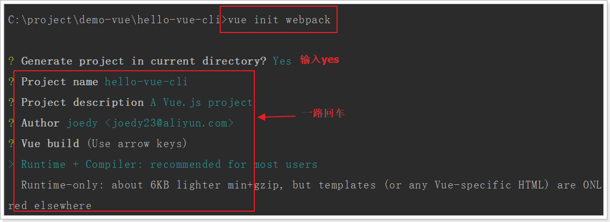
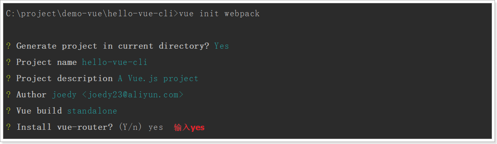
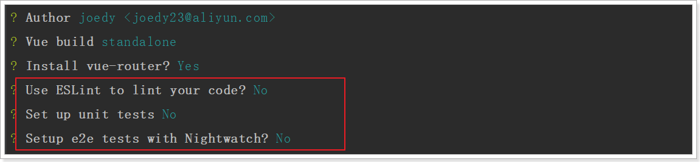
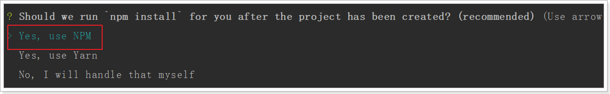
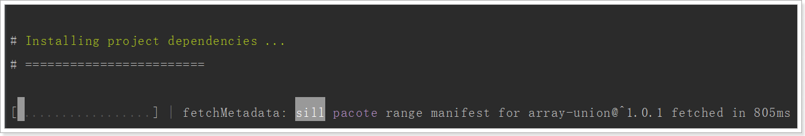
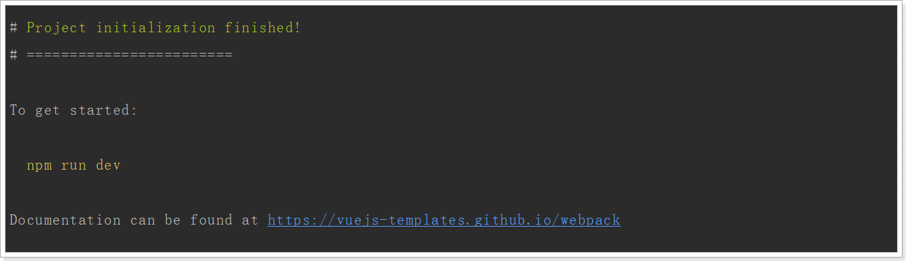
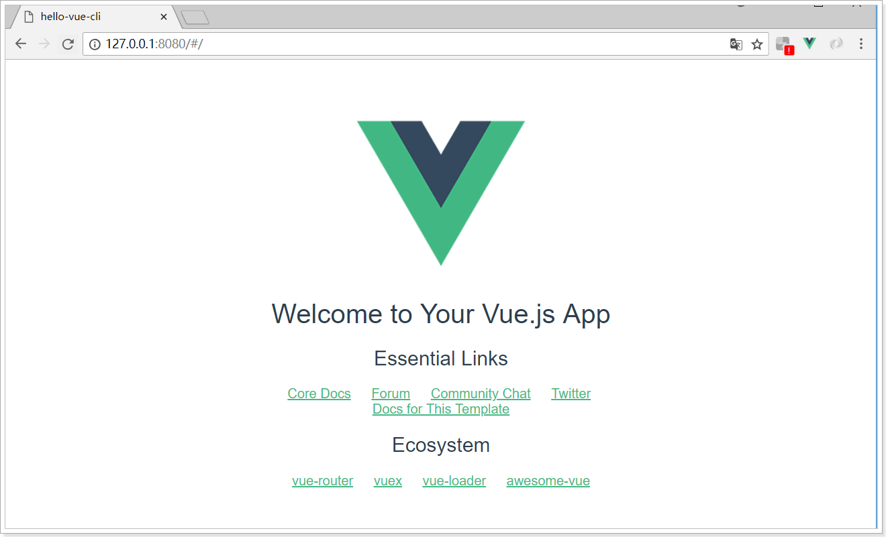

vscode使用

## 一、下载安装包

<https://code.visualstudio.com/Download>

下载对应的版本即可，这里使用的是windows版本


### 1.傻瓜式安装


### 2.设置中文

默认使用的是英文，可以通过设置成中文

#### 2.1 第一步

【Ctrl+Shift+P】在弹出的搜索框中输入【configure language】，然后选择搜索出来的【Configure Display Language】,如下图：


#### 2.2 第二步

点击安装其他语言


#### 2.3 第三步

在弹出的框中选择中文进行安装


#### 2.4 第四步

再次【Ctrl+Shift+P】在弹出的搜索框中输入【configure language】，选则zh-cn重启即可


#### 2.5 第五步 完成


## 二、安装插件

为了提高开发效率vs提供了大量的插件可以使用。

<https://marketplace.visualstudio.com/vscode>


### 1.安装方法

a.点击左侧按钮就行安装

搜索选择需要安装的软件，例如:Vetur 然后点击安装 即可


b..到官网搜索到自己需要的插件，然后点击安装


### 2.安装常用的插件

**Vetur** —— 语法高亮、智能感知、Emmet等 
包含格式化功能， Alt+Shift+F （格式化全文），Ctrl+K Ctrl+F（格式化选中代码，两个Ctrl需要同时按着）

**EsLint** —— 语法纠错

**Auto Close Tag** —— 自动闭合HTML/XML标签

**Auto Rename Tag **—— 自动完成另一侧标签的同步修改

**JavaScript(ES6) code snippets** —— ES6语法智能提示以及快速输入，除js外还支持.ts，.jsx，.tsx，.html，.vue，省去了配置其支持各种包含js代码文件的时间

**Path Intellisense **—— 自动路劲补全

**HTML CSS Support **—— 让 html 标签上写class 智能提示当前项目所支持的样式 

**open in borwser** ——浏览器

<https://www.cnblogs.com/QQ-Monarch/p/7130783.html>


## 三、创建vue项目

### 3.1 环境搭建

NPM (Node Package Manager),是一个基于Node.js的包管理器,是Node提供的模块管理工具，可以非常方便的下载安装很多前端框架，包括Jquery、AngularJS、VueJs都有。为了后面学习方便，我们先安装node及NPM工具。

[NPM中文文档](https://www.npmjs.cn/) <https://www.npmjs.cn/>


#### 3.1.1.下载Node.js

下载地址：https://nodejs.org/en/


推荐下载LTS版本。

傻瓜式直接安装：


完成以后，在控制台输入：

```powershell
node -v
```

看到版本信息：


#### 3.1.2.NPM

Node自带了NPM了，在控制台输入`npm -v`查看：


npm默认的仓库地址是在国外网站，速度较慢，建议大家设置到淘宝镜像。但是切换镜像是比较麻烦的。推荐一款切换镜像的工具：nrm

我们首先安装nrm，这里`-g`代表全局安装。可能需要一点儿时间

```
npm install nrm -g
```


然后通过`nrm ls`命令查看npm的仓库列表,带*的就是当前选中的镜像仓库：


通过`nrm use taobao`来指定要使用的镜像源：


然后通过`nrm test npm `来测试速度：


注意：

- 有教程推荐大家使用cnpm命令，但是使用发现cnpm有时会有bug，不推荐。
- 安装完成请一定要重启下电脑！！！
- 安装完成请一定要重启下电脑！！！
- 安装完成请一定要重启下电脑！！！


### 3.2.webpack

Webpack 是一个前端资源的打包工具，它可以将js、image、css等资源当成一个模块进行打包。

中文官方网站：https://www.webpackjs.com/


官网给出的解释：

> 本质上，*webpack* 是一个现代 JavaScript 应用程序的*静态模块打包器(module bundler)*。当 webpack 处理应用程序时，它会递归地构建一个*依赖关系图(dependency graph)*，其中包含应用程序需要的每个模块，然后将所有这些模块打包成一个或多个 *bundle*。 

为什么需要打包？

- 将许多碎小文件打包成一个整体，减少单页面内的衍生请求次数，提高网站效率。
- 将ES6的高级语法进行转换编译，以兼容老版本的浏览器。
- 将代码打包的同时进行混淆，提高代码的安全性。

#### 3.1.1.安装

webpack支持全局安装和本地安装，官方推荐是本地安装，我们按照官方的来。

安装最新版本webpack，输入命令：`npm install --save-dev webpack`

 webpack 4+ 版本，你还需要安装 CLI ，输入命令：`npm install webpack webpack-cli --save-dev`


### 3.3.vue-cli

在开发中，需要打包的东西不止是js、css、html。还有更多的东西要处理，这些插件和加载器如果我们一一去添加就会比较麻烦。

幸好，vue官方提供了一个快速搭建vue项目的脚手架：vue-cli

使用它能快速的构建一个web工程模板。

官网：https://github.com/vuejs/vue-cli


在e盘创建vue目录：

打开cmd命令:

安装命令：`npm install -g vue-cli`


用vue-cli命令，快速搭建一个webpack的项目：`vue init webpack`





前面几项都走默认或yes

下面这些我们选no



最后，再选yes，使用 npm安装



开始初始化项目，并安装依赖，可能需要



安装成功！



我们执行`npm run dev` 或者 `npm start` 都可以启动项目：


页面：




